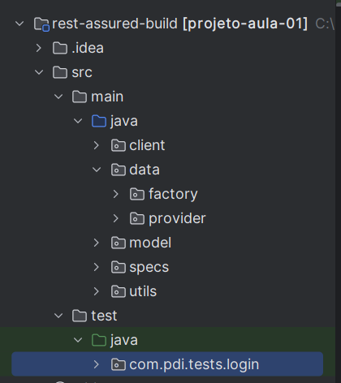

# Arquitetura Client-Test model
### JDK Usado: 17

## Estrutura do Projeto



### Client
Classe com configurações para realizar requisições http.  
Configuração, body, tipo de requisição

### Data
Classes responsáveis pela gestão de massa de dados.

### Model
Classe com os objetos com atributos de requisição e resposta

### Specs
Request e Response Specifications
- Consistência: Mantém os testes organizados e consistentes.
- Reutilização: Permite a reutilização de código comum em múltiplos testes.

Request Specification:  
● Define pré-configurações para os requests.

Response Specification:  
● Define Expectativas para as respostas.

### Utils
Package com classes uteis.  
**Exemplo**: Manipulation, classe responsável por ler um arquivo .properties.
Arquivo.properties será usado para guardar informações sensíveis como email e senha.
### Nomeando metodos
```java
@Test
public void testGetUsuarioPorIDComSucesso(){
    // Logica
}
```

### Depencicias para o projeto
````pom
<dependencies>
    <dependency>
        <groupId>io.rest-assured</groupId>
        <artifactId>rest-assured</artifactId>
        <version>5.4.0</version>
    </dependency>
    <dependency>
        <groupId>io.rest-assured</groupId>
        <artifactId>json-schema-validator</artifactId>
        <version>5.4.0</version>
    </dependency>
    <dependency>
        <groupId>org.junit.jupiter</groupId>
        <artifactId>junit-jupiter</artifactId>
        <version>5.10.0</version>
    </dependency>
    <dependency>
        <groupId>com.fasterxml.jackson.core</groupId>
        <artifactId>jackson-databind</artifactId>
        <version>2.14.2</version>
    </dependency>
    <dependency>
        <groupId>com.google.code.gson</groupId>
        <artifactId>gson</artifactId>
        <version>2.8.9</version>
    </dependency>
    <dependency>
        <groupId>net.datafaker</groupId>
        <artifactId>datafaker</artifactId>
        <version>1.7.0</version>
    </dependency>
    <dependency>
        <groupId>org.projectlombok</groupId>
        <artifactId>lombok</artifactId>
        <version>1.18.24</version>
    </dependency>
    <dependency>
        <groupId>org.wiremock</groupId>
        <artifactId>wiremock</artifactId>
        <version>3.3.1</version>
        <scope>test</scope>
    </dependency>
</dependencies>
````